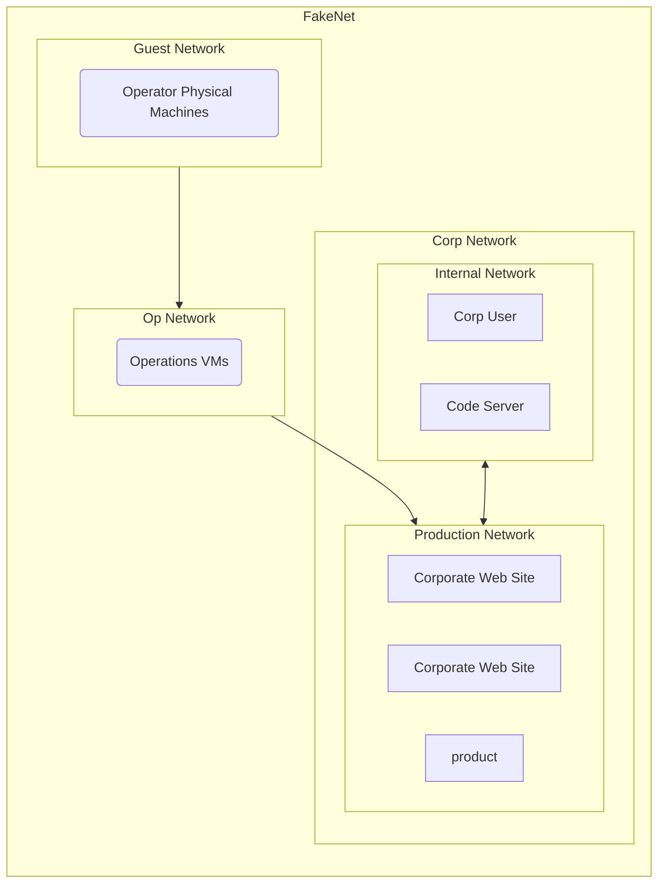
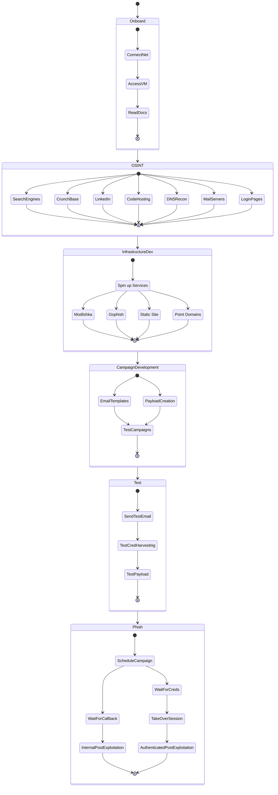

I've been working on a phishing training for SAINTCON. I used this to brainstorm how I wanted the network laid out.

## Network Diagram

```mermaid
flowchart TB
wifi-->opnet

subgraph labnet [FakeNet]
    direction TB

    subgraph corpnet [Corp Network]
        subgraph corpnetprod [Production Network]


            smtp[Corporate Web Site]
            www[Corporate Web Site]
            webapp[product]
        end

        subgraph corpnetinternal [Internal Network]

            corpuser[Corp User]
            codehosting[Code Server]

        end

    end


    subgraph wifi [Guest Network]
        operator001("Operator Physical Machines")
    end


    subgraph opnet [Op Network]
        op001("Operations VMs")
    end


    opnet-->corpnetprod;
    corpnetinternal<-->corpnetprod;

end
```

## Work Flows

```mermaid
stateDiagram-v2
    [*] --> Onboard
    Onboard --> OSINT
    OSINT --> InfrastructureDev
    InfrastructureDev --> CampaignDevelopment
    CampaignDevelopment --> Test
    Test --> Phish

    state Onboard {
        [*] --> ConnectNet
        ConnectNet --> AccessVM
        AccessVM --> ReadDocs
        ReadDocs --> [*]
    }

    state OSINT {
        [*] --> SearchEngines
        [*] --> CrunchBase
        [*] --> LinkedIn
        [*] --> CodeHosting
        [*] --> DNSRecon
        [*] --> MailServers
        [*] --> LoginPages
        SearchEngines --> [*]
        CrunchBase --> [*]
        LinkedIn --> [*]
        CodeHosting --> [*]
        DNSRecon --> [*]
        MailServers --> [*]
        LoginPages --> [*]
    }

    state InfrastructureDev {
        SpinUpServices : Spin up Services
        PointDomains : Point Domains
        StaticSite : Static Site

        [*] --> SpinUpServices
        SpinUpServices --> PointDomains
        SpinUpServices --> Modlishka
        SpinUpServices --> Gophish
        SpinUpServices --> StaticSite
        Modlishka --> [*]
        Gophish --> [*]
        StaticSite --> [*]
        PointDomains --> [*]
    }

    state CampaignDevelopment {

        [*] --> EmailTemplates
        [*] --> PayloadCreation
        EmailTemplates --> TestCampaigns
        PayloadCreation --> TestCampaigns
        TestCampaigns --> [*]
    }

    state Test {
        [*] --> SendTestEmail
        SendTestEmail --> TestCredHarvesting
        TestCredHarvesting --> TestPayload
        TestPayload --> [*]
    }

    state Phish {
        [*] --> ScheduleCampaign
        ScheduleCampaign --> WaitForCreds
        ScheduleCampaign --> WaitForCallback
        WaitForCreds --> TakeOverSession
        TakeOverSession --> AuthenticatedPostExploitation
        WaitForCallback --> InternalPostExploitation
        InternalPostExploitation --> [*]
        AuthenticatedPostExploitation --> [*]
    }
```